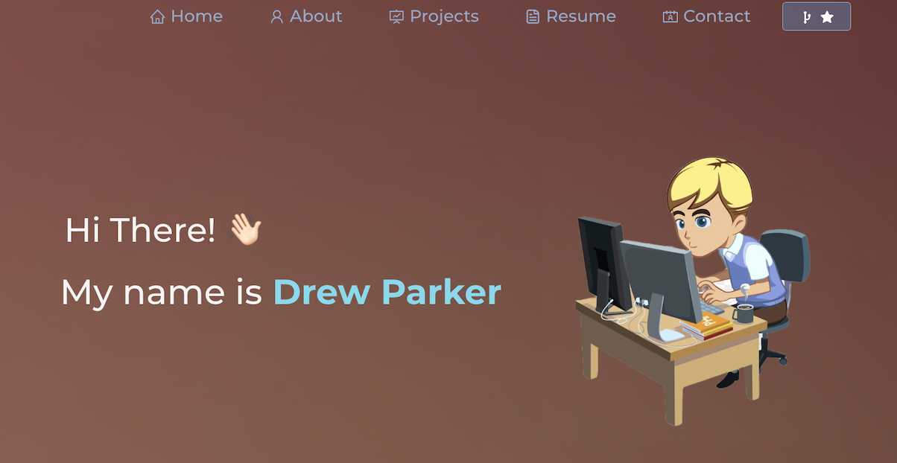

# Drew Parker - Portfolio Website  

  

My personal portfolio: <a href="https://drewsparker.github.io/portfolio/" target="_blank">click here to view!</a>  

 

## Built With

The following tech was implemented to build this portfolio:

- React.js
- Node.js
- Express.js
- CSS3
- VsCode

## Features

**📖 Multi-Page Layout**

**🎨 Styled with React-Bootstrap and CSS with easy to customize colors**

**📱 Fully Responsive**

## Getting Started

Clone down this repository. You will need `node.js` and `git` installed globally on your machine.

## 🛠 Installation and Setup Instructions

1. Installation: `npm install`

2. In the project directory, run: `npm start`

Runs the app in the development mode.\
Open [http://localhost:3000](http://localhost:3000) to view it in the browser.
The page will automatically reload if you make edits.

## Usage Instructions

Open the project folder and Navigate to `/src/components/`.  
You will find all the components used and you can edit your information accordingly.

## Collaborators

I got inspiration from a former portfolio that Soumyajit Behera created and revised a few settings.

## Questions

✉️ Email me with any questions: drewsparker@icloud.com 